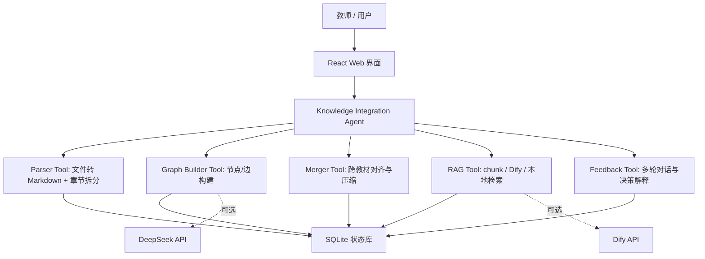
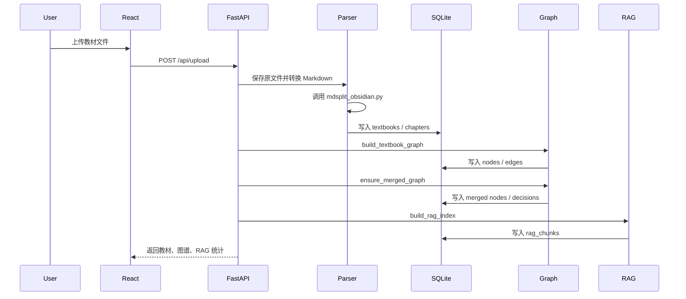
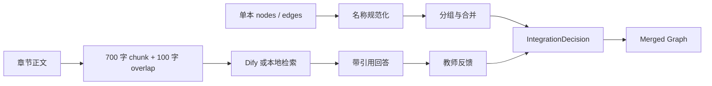

# Agent 架构说明

## 1. 架构选择

本项目采用“模块化单 Agent 编排”架构，而不是把系统拆成多个互相调用的自治 Agent。

核心判断是：赛题要求在 5 小时内交付稳定 Web 系统，关键不是让多个 Agent 自主协作，而是把长链路拆成边界清晰、可回放、可降级的工程模块。单 Agent 负责调度流程，文件解析、图谱构建、整合、RAG、对话分别作为确定性工具模块存在。



## 2. Agent / 模块职责

| 模块 | 职责 | 输入 | 输出 |
| --- | --- | --- | --- |
| Orchestrator | 统一调度上传、图谱、整合、RAG 和报告流程 | API 请求 | 任务结果和状态 |
| Parser Tool | 文件保存、格式转换、Markdown 章节拆分 | MarkItDown 支持格式 + MD/TXT | Textbook + Chapter |
| Graph Builder Tool | 从章节结构生成知识点节点和关系边 | Chapter | GraphNode + GraphEdge |
| Merger Tool | 跨教材去重、合并来源、计算压缩比 | 单本图谱 | merged graph + decisions |
| RAG Tool | chunk 生成、Dify 同步、问答检索 | Chapter + question | answer + citations |
| Feedback Tool | 教师对话、解释合并理由、记录意图 | message + history | response + decision update |
| Report Tool | 读取统计和决策生成报告 | DB stats | Markdown report |

## 3. 为什么选择单 Agent 编排

### 3.1 上下文可控

教材体量很大，不能把所有内容一次性交给一个 LLM 长上下文处理。当前做法是用确定性工具先切分章节并生成短线索，再由 DeepSeek 作为主要分析器提取关键词/知识点并补全标签；本地规则仅作为线索生成和失败降级。

### 3.2 降级简单

比赛演示最怕外部服务不可用。单 Agent 编排能明确知道每一步依赖什么：

- DeepSeek 不可用：规则图谱仍然生成。
- Dify 不可用：本地 chunk 检索仍然返回来源片段。
- MarkItDown 包不可用：尝试 CLI fallback。

多 Agent 架构如果缺少稳定消息协议和任务恢复机制，失败路径反而更复杂。

### 3.3 状态一致

所有模块都读写同一个 SQLite 状态库，图谱、整合决策、RAG chunk 和对话历史之间不会出现多 Agent 各自维护状态导致的不一致。

### 3.4 评审可解释

评审关注“为什么这样设计”。当前架构每个模块的输入输出都能用 API 和数据库表验证，便于复现和评分。

## 4. Prompt 工程

当前 LLM 主要用于关键词/知识点提取、标签补全和证据线索整理；系统仍要求 DeepSeek 基于章节标题和线索输出严格 JSON，不允许自由编造教材外知识。

### 4.1 系统约束

```text
你是医学教材知识图谱构建专家。只返回 JSON，不要输出解释。
```

### 4.2 用户提示模板

```text
请提取核心关键词/知识点，补全 definition/category/body_system/scale_level/stage/importance，
输出格式：
{
  "nodes": [
    {
      "id": "...",
      "keep": true,
      "definition": "...",
      "category": "...",
      "body_system": "...",
      "scale_level": "...",
      "stage": "...",
      "importance": "high|medium|low",
      "reason": "..."
    }
  ]
}
```

### 4.3 防幻觉策略

1. 只传候选节点的名称、定义和证据片段。
2. 要求只返回 JSON，减少自然语言漂移。
3. LLM 失败不阻塞主流程，系统保留规则结果。
4. RAG prompt 由 Dify 应用负责，要求回答必须基于知识库上下文并返回引用。

## 5. 数据流与调用链路

### 5.1 上传教材



### 5.2 整合与问答



## 6. 关键接口输入输出

| 接口 | 输入 | 输出 |
| --- | --- | --- |
| `POST /api/upload` | multipart file | textbook、graph_stats、merged_stats、rag_index、dify_sync |
| `GET /api/knowledge/graph/{id}` | textbook_id | nodes、edges、stats |
| `POST /api/integrate/start` | 无 | merged graph、integration stats |
| `GET /api/integrate/decisions` | 无 | merge/compress 决策列表 |
| `POST /api/rag/query` | question、conversation_id | answer、citations、provider |
| `POST /api/chat/message` | session_id、message | answer、citations、provider |
| `GET /api/report/generate` | 无 | Markdown 报告 |

## 7. RAG Pipeline 设计

### 7.1 Chunking

- chunk_size：700 字
- overlap：100 字
- 元数据：教材名称、章节标题、字符起止位置

选择 700 字是因为医学教材中一个概念往往包含定义、机制、临床表现和防治说明，300 字容易截断，1200 字又会降低检索精度。

### 7.2 Embedding / 检索

当前线上路径优先交给 Dify 知识库处理 embedding、索引和检索。系统本地生成 chunk 并调用 Dify Dataset API 同步文本。

降级路径使用本地关键词打分，目的不是替代向量检索，而是在 Dify 未配置或网络失败时保证演示能展示相关教材片段。

### 7.3 生成回答

Dify Chat 应用负责最终生成。应用 prompt 应满足：

```text
只基于检索上下文回答。
每个结论给出教材和章节引用。
找不到答案时回答“当前知识库中未找到相关信息”。
```

## 8. 取舍与权衡

### 8.1 放弃完整多 Agent 框架

没有采用 CrewAI、AutoGen 或 LangGraph。原因是本项目的主要风险在文档解析和图谱质量，而不是复杂任务协作。引入多 Agent 框架会增加部署依赖、调试成本和失败点。

### 8.2 放弃强依赖向量库

没有在本地强制安装 FAISS 或 ChromaDB。原因是魔搭创空间部署和比赛演示需要最小依赖。Dify 可承担正式 RAG，SQLite chunk + 本地检索用于降级。

### 8.3 先用章节图谱而不是全文术语图谱

术语级图谱更细，但抽取成本高、噪声多。章节图谱先保证教学结构、交互和整合统计可用，再通过 LLM 审核逐步增强知识点质量。

### 8.4 报告采用字符压缩比

页数和版式在 PDF、Office、HTML、Markdown 等格式之间不可比，字符数是更稳定的统计口径。系统保留原文 chunk 供引用，因此图谱压缩不会破坏 RAG 可追溯性。

## 9. 创新点

### 9.1 双层知识库

系统同时保留“压缩后的图谱知识库”和“完整原文 RAG chunk”。图谱用于课程整合，chunk 用于证据追溯，避免压缩后无法回答细节问题。

### 9.2 面向医学教材的标签体系

节点不仅有 category，还包含 body_system、organ、anatomical_region、scale_level、stage，方便教师按器官系统、疾病阶段和知识尺度筛选。

### 9.3 可降级的 RAG 演示路径

Dify 配置完整时是真实 RAG；配置缺失或调用失败时回退本地检索，并把 provider 状态显式返回给前端。这样评审能看到系统不是静态 Demo。

### 9.4 学习材料扩展面板

右侧面板预留思维导图、闪卡、闯关游戏和报告下载入口。当前已实现闯关样例和图谱导向材料，为后续接入 NotebookLM 或自动课件生成留出接口。

## 10. 已知局限与改进计划

| 局限 | 影响 | 改进 |
| --- | --- | --- |
| 语义对齐主要靠规范化名称 | 同义不同名可能漏合并 | 接入 BGE embedding + LLM 二次判定 |
| 章节级节点较粗 | 图谱不够细 | 对定义句、表格项、术语括注做候选抽取 |
| 本地检索不是向量检索 | Dify 未配置时问答质量有限 | 增加 FAISS/ChromaDB 可选路径 |
| PDF 页码不稳定 | 引用不能精确到页 | 转换阶段保存页码映射或 OCR 坐标 |
| 对话反馈修改较轻量 | 复杂结构变更仍需人工 | 增加决策事件日志和图谱重写规则 |

## 11. 实验数据

基于内置 7 本教材的干净运行统计：

| 指标 | 数值 |
| --- | ---: |
| 教材数量 | 7 |
| 原始字符数 | 8,800,495 |
| 单本原始节点数 | 795 |
| 整合后节点数 | 772 |
| 原始关系数 | 1,309 |
| 整合后关系数 | 1,309 |
| 整合决策数 | 15 |
| RAG chunks | 5,661 |
| 整合摘要字符数 | 160,312 |
| 压缩比 | 1.82% |

这些数据说明当前架构能在本地一次性加载 7 本教材、构建图谱、生成 RAG chunk，并满足压缩比约束。
