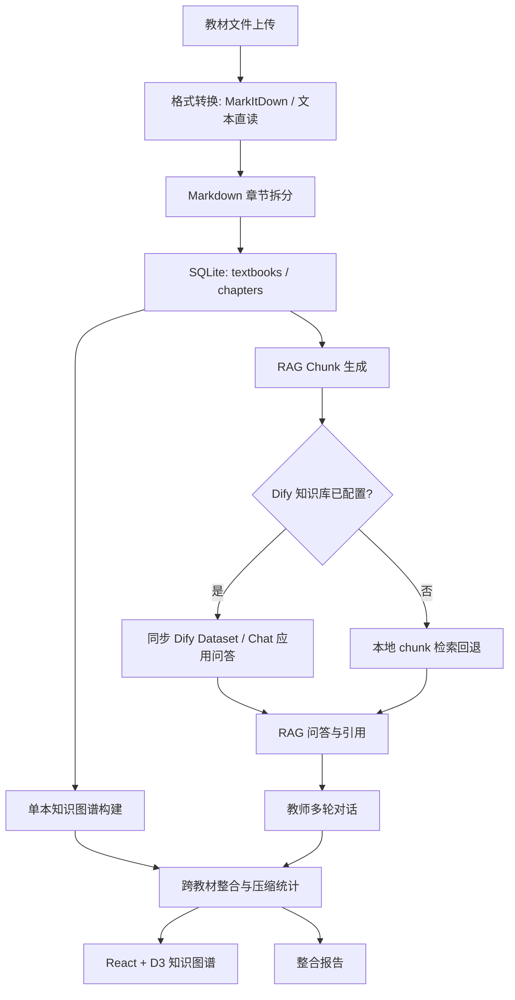

# 系统设计

## 1. 架构总览

系统采用 FastAPI 后端 + React/Vite 前端 + SQLite 本地状态库的轻量全栈架构。教材首先统一转换为 Markdown，再生成章节、知识图谱、整合图谱和 RAG chunk。LLM 和 Dify 都是可插拔外部能力，未配置时系统仍可用内置规则和本地检索降级运行。



## 2. 技术选型

| 层级 | 选型 | 理由 |
| --- | --- | --- |
| 后端 | FastAPI | 接口声明清晰，适合快速提供 REST API |
| 前端 | React 18 + Vite + TypeScript | 开发速度快，便于复杂交互状态管理 |
| 图谱可视化 | D3 force simulation | 原生支持缩放、拖拽、节点大小和颜色映射 |
| 存储 | SQLite | 比赛场景无需额外数据库服务，部署简单 |
| 文档转换 | MarkItDown | 统一 PDF、DOCX、TXT、MD 到 Markdown |
| 章节拆分 | `scripts/mdsplit_obsidian.py` | 已针对中文教材章节标题做过适配 |
| LLM | DeepSeek/OpenAI-compatible API | 用于候选知识点审核、补标签和后续语义判断 |
| RAG | Dify + 本地回退检索 | Dify 提供知识库和 Chat 应用能力，本地回退保证演示稳定 |
| 部署 | Docker / 魔搭创空间 | 单容器运行，暴露 `7860` |

## 3. 后端模块

| 模块 | 文件 | 职责 |
| --- | --- | --- |
| API 路由 | `backend/main.py` | 定义上传、图谱、整合、RAG、对话、报告接口 |
| 业务服务 | `backend/services.py` | 教材注册、图谱构建、整合、Dify 同步、报告生成 |
| 文本处理 | `backend/text_processing.py` | 标题清洗、稳定 ID、定义提取、chunk 分块 |
| 数据库 | `backend/database.py` | SQLite schema、JSON 字段序列化 |
| 配置 | `backend/config.py` | `.env`、数据路径、外部服务配置 |
| Schema | `backend/schemas.py` | Pydantic 数据模型 |

## 4. 前端布局

界面是单页应用，按赛题建议拆成三栏：

| 区域 | 功能 |
| --- | --- |
| 左侧教材管理 | 上传文件、显示教材列表、展示压缩统计 |
| 中间图谱区 | D3 力导向图、节点搜索、系统筛选、展开/收起、节点详情 |
| 右侧功能面板 | 整合决策、RAG 问答、教师对话、学习材料、闯关游戏 |

视觉编码：

- 节点大小表示出现频次。
- 多来源节点使用高亮颜色。
- 不同教材来源用固定色板区分。
- contains 边使用箭头，parallel 边使用虚线。

## 5. 数据模型

### Textbook

```json
{
  "id": "01_局部解剖学",
  "title": "局部解剖学",
  "filename": "01_局部解剖学.md",
  "status": "ready",
  "total_chars": 829771,
  "chapter_count": 61
}
```

### Chapter

```json
{
  "id": "ch_xxx",
  "textbook_id": "01_局部解剖学",
  "title": "第一章 头部",
  "level": 1,
  "parent_id": null,
  "content": "...",
  "char_count": 8500,
  "metadata": {
    "relative_path": "01_第一章头部/index.md"
  }
}
```

### GraphNode

```json
{
  "id": "node_xxx",
  "name": "肺",
  "definition": "肺是教材中的核心知识点...",
  "category": "解剖结构",
  "body_system": "呼吸系统",
  "frequency": 2,
  "evidence": "证据片段...",
  "source_textbooks": ["局部解剖学", "组织学与胚胎学"],
  "confidence": 0.8
}
```

### IntegrationDecision

```json
{
  "id": "decision_xxx",
  "action": "merge",
  "affected_nodes": ["node_a", "node_b"],
  "result_node": "merged_xxx",
  "reason": "2 本教材出现“肺”或近似标题，保留证据更完整的版本并合并来源。",
  "confidence": 0.8,
  "char_saved": 115,
  "status": "active"
}
```

## 6. 数据流

### 上传教材到图谱

1. 前端调用 `POST /api/upload` 上传文件。
2. 后端保存原始文件到 `data/textbooks/`。
3. Markdown/TXT 直接读取，PDF/DOCX 调用 MarkItDown 转换。
4. 调用 `scripts/mdsplit_obsidian.py` 拆成章节。
5. 写入 `textbooks` 和 `chapters` 表。
6. 构建单本图谱，写入 `nodes` 和 `edges`。
7. 重建跨教材整合图谱。
8. 生成本地 RAG chunk，并在 Dify 配置完整时同步知识库。

### 构建整合图谱

1. 读取所有单本教材节点。
2. 对节点名称做规范化：去编号、括注、标点和大小写。
3. 相同规范名归为一组。
4. 选择定义和证据更完整的节点作为基础节点。
5. 合并来源教材、出现频次和置信度。
6. 写入 merge 决策；未合并节点自然保留。
7. 将原始边映射到整合节点，去掉自环和重复边。
8. 计算压缩比和节省字符数。

### RAG 问答

1. `POST /api/rag/index` 将章节正文切成 700 字 chunk，100 字 overlap。
2. 每个 chunk 记录教材、章节和字符位置。
3. 如果 Dify 知识库配置完整，调用 Dify Dataset API 同步文本。
4. 用户提问时，优先调用 Dify Chat API。
5. Dify 不可用时，回退到本地 chunk 关键词检索。
6. 前端展示回答、引用来源和相关片段。

## 7. API 一览

| 方法 | 路径 | 说明 |
| --- | --- | --- |
| GET | `/health` | 健康检查和配置摘要 |
| GET | `/api/config/status` | DeepSeek、Dify、数据库、教材统计 |
| POST | `/api/upload` | 上传并解析教材 |
| GET | `/api/textbooks` | 获取教材列表 |
| GET | `/api/textbooks/{id}` | 获取单本教材章节 |
| DELETE | `/api/textbooks/{id}` | 删除用户上传教材 |
| POST | `/api/knowledge/extract/{id}` | 重新构建单本图谱，可触发 LLM 审核 |
| GET | `/api/knowledge/graph/{id}` | 单本教材图谱 |
| GET | `/api/knowledge/graph/merged` | 跨教材整合图谱 |
| POST | `/api/integrate/start` | 重新整合 |
| GET | `/api/integrate/decisions` | 整合决策列表 |
| PUT | `/api/integrate/decisions/{id}` | 更新决策状态或理由 |
| GET | `/api/integrate/stats` | 压缩比、节点数、chunk 数统计 |
| POST | `/api/rag/index` | 生成 RAG chunk，可同步 Dify |
| POST | `/api/rag/query` | RAG 问答 |
| POST | `/api/chat/message` | 教师多轮对话 |
| GET | `/api/report/generate` | 生成 Markdown 报告 |

## 8. 降级策略

| 依赖 | 正常路径 | 降级路径 |
| --- | --- | --- |
| MarkItDown Python 包 | 直接转换 PDF/DOCX | 查找 CLI；仍失败则返回明确错误 |
| DeepSeek | 审核候选知识点 | 使用规则图谱，不阻塞核心流程 |
| Dify Knowledge API | 同步 chunk 到知识库 | 只生成本地 chunk |
| Dify Chat API | 生成带引用回答 | 本地 chunk 检索并提示配置状态 |
| 前端构建产物 | FastAPI 托管 SPA | 开发环境用 Vite dev server |

## 9. 已知局限

1. 当前图谱节点主要来自章节结构，术语级抽取依赖后续 LLM 强化。
2. 语义对齐当前以规范化名称为主，还没有启用 embedding 阈值匹配。
3. 本地 RAG 回退是关键词检索，不等价于向量数据库。
4. PDF 页码尚未稳定写入 chunk 元数据，当前以章节和字符位置作为引用定位。
5. 教师对话能识别保留/拆分意图，但自动修改图谱结构仍是最小实现。

## 10. 后续改进

1. 接入 BGE-small-zh 或 multilingual MiniLM，增加向量检索和相似度对齐。
2. 对同一组候选节点使用 LLM 二次判定，减少同名异义误合并。
3. 引入 RAG Benchmark，评估不同 chunk_size、overlap 和 rerank 策略。
4. 支持报告导出 PDF。
5. 将教师对话反馈转为可审计的图谱变更事件。
