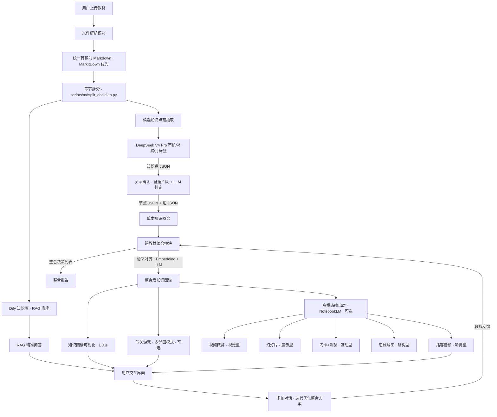

# 学科知识整合智能体 · 全栈架构设计文档

> **用途**：本文档是完整的开发蓝图，交给 Codex / Claude Code 等 AI 编码工具即可按模块逐步实现。
> **比赛**：AI 全栈极速黑客松（5 小时）
> **核心命题**：把 7 本教材变成不到 2.1 本的精华，且教学效果不打折。

---

## 一、设计哲学

**一句话概括**：这道题的本质是"去重"——两条信号流（知识图谱 + RAG 问答）共享一个分块层，核心难点是跨教材语义对齐的准确率，其余都是工程体力活。

**三条设计原则**：

1. **每一层都有独立降级方案**——没有任何单点依赖是致命的
2. **核心管线保 P0 分数，输出层冲创新分数**——NotebookLM 挂了 P0 全部正常
3. **压缩不是目的，让不同学习风格的学生能高效学会才是目的**——多模态学习材料矩阵

---

## 二、架构总览

```
┌─────────────────────────────────────────────────────────────────┐
│                        前端 · React SPA                         │
│  ┌──────────┐  ┌──────────────────┐  ┌────────────────────────┐ │
│  │ 教材管理  │  │   知识图谱可视化   │  │  功能面板 (Tab切换)     │ │
│  │ 上传/列表 │  │   D3.js 力导向图   │  │  · 整合操作            │ │
│  │ 解析状态  │  │   交互/搜索/缩放   │  │  · RAG 问答            │ │
│  │          │  │                  │  │  · 多轮对话             │ │
│  │          │  │                  │  │  · 学习材料(多模态, 可选) │ │
│  │          │  │                  │  │  · 闯关游戏(可选)        │ │
│  └──────────┘  └──────────────────┘  └────────────────────────┘ │
└──────────────────────────┬──────────────────────────────────────┘
                           │ REST API
┌──────────────────────────▼──────────────────────────────────────┐
│                     后端 · FastAPI (Python)                      │
│                                                                  │
│  ┌────────────┐  ┌────────────┐  ┌────────────┐  ┌───────────┐ │
│  │ 文件解析    │  │ 知识提取    │  │ 跨教材整合  │  │ 对话管理   │ │
│  │ 全格式→MD   │  │ DeepSeek   │  │ 语义对齐    │  │ 历史持久化 │ │
│  │ 分章节工具   │  │ V4 Pro     │  │ 整合决策    │  │           │ │
│  └────────────┘  └────────────┘  └────────────┘  └───────────┘ │
│                                                                  │
│  ┌────────────────────┐  ┌──────────────────────────────────┐   │
│  │ RAG 引擎           │  │ 多模态输出层                      │   │
│  │ Dify API (知识库    │  │ notebooklm-py                    │   │
│  │ chunking+embedding │  │ 播客/视频/幻灯片/闪卡/思维导图     │   │
│  │ +检索+生成)        │  │ (异步生成, 可降级为预置缓存)       │   │
│  └────────────────────┘  └──────────────────────────────────┘   │
└──────────────────────────────────────────────────────────────────┘
```

### Mermaid 架构图



---

## 三、技术栈

| 层级 | 选型 | 版本/说明 | 角色 |
|------|------|-----------|------|
| 前端框架 | React 18 + Vite | TypeScript | 三栏 SPA |
| UI 组件 | Tailwind CSS + shadcn/ui | - | 快速成型 |
| 知识图谱可视化 | D3.js (force-directed graph) | v7 | 力导向图 + 交互 |
| 后端框架 | FastAPI | Python 3.11+ | REST API + WebSocket |
| 文档统一转换 | MarkItDown 优先，PyMuPDF 兜底 | - | PDF/DOCX/TXT/MD 等全部先转 Markdown |
| 章节拆分 | `scripts/mdsplit_obsidian.py` | 本地工具 | 基于 Markdown 标题或中文教材章节模式分章 |
| RAG 引擎 | Dify (API 模式) | 自托管或 Cloud | chunking + embedding + 检索 |
| LLM 调用 | DeepSeek V4 Pro | DeepSeek API | 知识提取、语义对齐、关系判定、对话 |
| 多模态输出 | notebooklm-py | 非官方 Python API，可选 | 播客/视频/幻灯片/闪卡/思维导图，时间允许再做 |
| 闯关游戏 | React 组件 (内置) | 可选创新层 | 多邻国风格交互学习，时间允许再做 |
| 部署 | 魔搭创空间 / Vercel+Railway | - | 公网可访问 |

---

## 四、模块详细设计

### 4.1 文件解析模块

**职责**：接收多种格式教材，先全部转换为 Markdown，再复用本地分章节工具输出结构化章节数据（带章节、页码/位置元数据）。

**输入**：用户上传的文件（PDF/DOCX/TXT/MD）

**核心管线**：

```
上传文件
  → 原始文件入库 data/textbooks/
  → 全格式统一转换为 Markdown data/markdown/{textbook_id}.md
  → 调用 scripts/mdsplit_obsidian.py 分章节
  → 读取拆分结果，生成 chapters JSON
  → 同一份 chapters 同时供知识图谱抽取和 RAG 分块使用
```

**输出数据结构**：
```json
{
  "textbook_id": "book_01",
  "filename": "数据结构与算法.pdf",
  "title": "数据结构与算法",
  "total_pages": 520,
  "total_chars": 385000,
  "chapters": [
    {
      "chapter_id": "ch_01",
      "title": "第一章 绪论",
      "page_start": 1,
      "page_end": 15,
      "content": "数据结构是计算机存储、组织数据的方式...",
      "char_count": 8500
    }
  ]
}
```

**实现策略**：

```python
import subprocess
from pathlib import Path
from markitdown import MarkItDown

def convert_to_markdown(filepath: Path, textbook_id: str) -> Path:
    """所有输入格式统一先转 Markdown。"""
    output = Path("data/markdown") / f"{textbook_id}.md"
    output.parent.mkdir(parents=True, exist_ok=True)

    if filepath.suffix.lower() in {".md", ".markdown"}:
        output.write_text(filepath.read_text(encoding="utf-8", errors="ignore"), encoding="utf-8")
        return output

    md = MarkItDown(enable_plugins=False)
    result = md.convert(filepath)
    output.write_text(result.text_content, encoding="utf-8")
    return output

def split_markdown_to_chapters(markdown_path: Path) -> Path:
    """复用现有中文教材分章节工具，输出 Obsidian 风格章节目录。"""
    subprocess.run(
        [
            "python3",
            "scripts/mdsplit_obsidian.py",
            str(markdown_path),
            "--out",
            "data/split",
            "--mode",
            "auto",
            "--max-level",
            "2",
            "--force",
        ],
        check=True,
    )
    return Path("data/split") / markdown_path.stem

def parse_textbook(filepath: Path, textbook_id: str) -> dict:
    markdown_path = convert_to_markdown(filepath, textbook_id)
    split_dir = split_markdown_to_chapters(markdown_path)
    return load_chapters_from_split_dir(split_dir, source_file=filepath)
```

**本地批量拆分命令**（当前已有工具）：

```bash
python3 scripts/mdsplit_obsidian.py 教材/*.md --out 拆分结果 --mode auto --max-level 2 --force
```

**API 接口**：
```
POST /api/upload          → 上传文件，返回 textbook_id + 解析任务 ID
GET  /api/textbooks       → 已上传教材列表（含解析状态）
GET  /api/textbooks/{id}  → 单本教材详情（章节结构）
```

**注意**：
- Markdown 是全系统的唯一中间格式，后续知识抽取、RAG 分块、报告生成都读取同一份 Markdown/章节结果
- PDF 转 Markdown 优先使用 MarkItDown；如果遇到扫描版或页码丢失，再用 PyMuPDF/OCR 做兜底转换，但仍然输出 Markdown
- `scripts/mdsplit_obsidian.py` 支持 `auto/markdown/textbook` 三种模式，优先 `auto`：有标准 `#` 标题时按 Markdown 标题拆，否则按中文教材"第X章/第X节"识别
- 拆分结果需要保留源文件、章节标题、章节层级、正文、字符数；页码无法稳定识别时，用 Markdown 位置或原始块序号作为兜底引用定位

---

### 4.2 知识提取模块（LLM 调用）

**职责**：从分章节 Markdown 中提取结构化知识点。核心策略不是把全文直接交给 LLM 自由抽取，而是先用文本结构和规则生成候选知识点，再让 DeepSeek V4 Pro 做查漏补缺、标签归类和证据校验。

**设计原因**：
- 医学教材篇幅大，全文或整章直接输入 LLM 会产生高 token 成本和长上下文遗漏。
- 教材本身有强结构：目录、章节标题、小节标题、黑体术语、定义句、列表和表格都能提供高质量候选。
- LLM 更适合做审核、补漏、归类、歧义判断，而不是承担所有粗抽取工作。

**分阶段知识提取流程**：

```
章节 Markdown
  → 结构预抽取：标题/小节/列表/表格/定义句
  → 候选知识点池：术语 + 证据片段 + 来源位置
  → 去噪去重：同章内近似术语合并、过滤过短/泛化词
  → DeepSeek V4 Pro 审核：确认候选是否为知识点
  → DeepSeek V4 Pro 查漏：基于章节摘要和候选列表补充遗漏
  → DeepSeek V4 Pro 打标签：category、importance、body_system、organ、scale_level、stage
  → 输出 nodes JSON
  → 进入关系确认模块生成 edges
```

**候选知识点预抽取规则**：

| 来源 | 抽取方式 | 示例 |
|------|----------|------|
| 标题结构 | 章、节、条标题直接入候选 | `第五章 免疫性疾病`、`第一节 自身免疫病` |
| 定义句 | 匹配"X 是/指/称为/定义为..." | `炎症是具有血管系统的活体组织...` |
| 分类句 | 匹配"分为/包括/由...组成" | `白细胞包括中性粒细胞、淋巴细胞...` |
| 医学术语模式 | 中文术语 + 英文括注、缩写、专有名词 | `炎症(inflammation)`、`急性期蛋白(APP)` |
| 列表/表格 | 表头、项目名、并列项入候选 | 病原体列表、疾病分类表 |
| 高频局部名词 | 同一章内重复出现且非停用词 | `肺泡`、`巨噬细胞`、`结核分枝杆菌` |

**候选数据结构**：

```json
{
  "candidate_id": "cand_001",
  "name": "炎症",
  "evidence": "炎症是具有血管系统的活体组织对各种损伤因子的刺激所发生的防御性反应。",
  "source_type": "definition_sentence",
  "textbook": "病理学",
  "chapter": "第四章 炎症",
  "section": "第一节 炎症概述",
  "page": 78,
  "char_start": 1820,
  "char_end": 1888
}
```

**DeepSeek V4 Pro 审核 Prompt**（输入候选列表 + 少量证据，不输入整章全文）：

```
你是医学教材知识图谱构建专家。下面是从教材章节中用规则预抽取出的候选知识点。
请判断每个候选是否应作为知识图谱节点，并补全分类标签。

## 章节信息
教材：{textbook_title}
章节：{chapter_title}
小节：{section_title}

## 候选知识点
{candidate_list_with_evidence}

## 输出要求
请严格按照以下 JSON 格式输出，不要输出任何其他内容：

{
  "nodes": [
    {
      "candidate_id": "cand_001",
      "keep": true,
      "name": "知识点名称",
      "definition": "一句话定义（不超过100字）",
      "category": "解剖结构|组织细胞|生理功能|病理变化|病理机制|病原体|疾病|诊断检查|治疗预防|核心概念",
      "body_system": "呼吸系统|循环系统|消化系统|神经系统|免疫系统|全身/通用|未知",
      "organ": "器官或部位，未知则填未知",
      "scale_level": "宏观解剖|器官|组织|细胞|分子|病原体|疾病/临床|未知",
      "stage": "正常结构|正常功能|病理生理|病理形态|感染传播|临床应用|未知",
      "chapter": "{chapter_title}",
      "page": 页码数字,
      "importance": "high|medium|low",
      "evidence": "保留最短原文证据片段",
      "reason": "为什么保留或删除"
    }
  ]
}
```

**DeepSeek V4 Pro 查漏 Prompt**（输入章节摘要 + 已确认节点名称，不输入全文）：

```
下面是某医学教材小节的摘要和已经确认的知识点列表。
请只检查是否遗漏了对教学必需的核心知识点。
如果没有遗漏，返回空数组。

## 小节摘要
{section_summary}

## 已确认知识点
{confirmed_node_names}

## 输出 JSON
{
  "missing_nodes": [
    {
      "name": "遗漏知识点",
      "definition": "一句话定义",
      "category": "...",
      "importance": "high|medium|low",
      "evidence_keyword": "可在原文中检索到的关键词",
      "reason": "为什么候选规则可能漏掉它"
    }
  ]
}
```

**Token 控制策略**：
- 不把全文直接交给 LLM；LLM 输入候选列表、证据片段、章节摘要和已确认节点名
- 每批候选控制在 20-40 个，超过则按小节分批
- 每个候选只带 1-2 条最短证据片段，证据片段控制在 80-160 字
- 只有查漏阶段需要章节摘要，摘要由规则截取标题、首尾段、定义句和列表项拼接生成
- 关系确认单独处理，只给两个节点和相关证据片段，避免一次性生成全图边

**防幻觉策略**：
- 知识点必须来自候选证据或查漏后能用 `evidence_keyword` 回原文检索命中
- 要求输出 JSON 并做 schema 校验
- `keep=false` 的候选保留删除理由，便于调试规则
- definition 必须能在原文中找到对应表述，不能凭模型常识扩写
- importance 字段用于后续压缩时的优先级排序
- LLM 只输出节点，不在同一步自由生成关系；关系进入 4.2.1 的证据化确认流程

**API 接口**：
```
POST /api/knowledge/extract/{textbook_id}   → 触发知识提取（异步）
GET  /api/knowledge/graph/{textbook_id}     → 获取单本教材的图谱 JSON
GET  /api/knowledge/status/{textbook_id}    → 提取进度
```

#### 4.2.1 知识点关系确认机制（医学增强版）

**核心原则**：关系边不是让 LLM 自由发挥生成，而是采用"候选关系生成 → 原文证据校验 → LLM 二次判定 → 置信度评分 → 教师可修正"的流程。每一条边必须能回溯到教材原文或章节结构依据。

**P0 通用关系类型**（满足赛题要求）：

| 关系类型 | 判定标准 | 医学示例 |
|----------|----------|----------|
| `contains` | A 是上位概念，B 是组成部分、分类或子过程 | 免疫系统 contains T 细胞 |
| `prerequisite` | 学 B 前必须理解 A，或 B 的定义明显依赖 A | 动作电位 prerequisite 静息电位 |
| `parallel` | 同一上位概念下的兄弟概念 | 有丝分裂 parallel 减数分裂 |
| `applies_to` | A 是机制、概念或方法，B 是应用场景、疾病或现象 | 抗体 applies_to 体液免疫 |

**医学语义关系类型**（内部增强字段，用于人体图谱、时间轴和临床问答）：

| 医学关系 | 实际价值 | 示例 |
|----------|----------|------|
| `located_in` | 支撑人体位置维度、器官导航 | 肺炎 located_in 肺 |
| `part_of` / `contains` | 支撑解剖、组织、细胞层级 | 肺泡 part_of 肺 |
| `is_a` | 建立概念分类层级，便于去重归类 | 金黄色葡萄球菌 is_a 细菌 |
| `causes` | 支撑病因和病理推理 | 结核分枝杆菌 causes 结核病 |
| `leads_to` / `develops_into` | 支撑时间维度、病程演化 | 感染 leads_to 炎症反应 |
| `manifests_as` | 连接机制与症状、体征 | 炎症 manifests_as 红肿热痛 |
| `mechanism_of` / `mediates` | 连接生理、病理生理、病理 | 免疫复合物沉积 mediates III 型超敏反应 |
| `diagnosed_by` | 支撑检查和诊断依据问答 | 结核病 diagnosed_by 痰涂片抗酸染色 |
| `treated_by` | 支撑临床应用，作为 P1/P2 扩展 | 细菌感染 treated_by 抗生素 |
| `prevents` | 支撑传染病和免疫预防 | 疫苗 prevents 特定传染病 |
| `risk_factor_for` | 支撑疾病风险管理 | 吸烟 risk_factor_for 肺癌 |
| `complication_of` | 支撑疾病链路和严重程度判断 | 感染性休克 complication_of 严重感染 |
| `differential_with` | 支撑鉴别诊断，作为高级扩展 | 病毒性肺炎 differential_with 细菌性肺炎 |

**比赛阶段优先实现的医学关系**：`located_in`、`part_of/contains`、`causes`、`leads_to/develops_into`、`manifests_as`、`mechanism_of/mediates`。这 6 类最适合当前 7 本医学教材，能直接服务人体位置视图、切片层级视图、病程时间轴和 RAG 问答。

**关系确认流程**：

1. **章节结构生成强关系**：章节、二级标题、列表、表格天然提供 `contains` 和 `parallel` 候选。例如"炎症的基本病理变化"下的"变质、渗出、增生"可判为同一上位概念下的并列节点。
2. **文本触发词生成候选边**：用规则扫描"包括、分为、由...组成、导致、引起、表现为、位于、参与、调节、介导、用于"等触发词，生成候选 `contains/causes/manifests_as/located_in/mechanism_of`。
3. **限定候选范围**：只在同一章节、相邻章节、同一人体部位、同一器官系统、同一上位概念、跨教材近义节点之间找关系，避免全量两两比较导致噪声和成本失控。
4. **LLM 二次判定**：给定知识点 A、知识点 B、原文片段和候选关系，让 LLM 判断是否成立；证据不足时必须输出 `none`。
5. **一致性校验**：`contains` 尽量形成层级 DAG，`prerequisite` 不允许明显环路，`parallel` 节点应尽量共享同一上位节点，低置信度边默认隐藏或标为待确认。
6. **教师可修正**：整合和对话模块允许教师删除边、改边类型或补充关键关系，修改后图谱实时更新。

**增强后的边数据结构**：

```json
{
  "source": "node_001",
  "target": "node_002",
  "relation_type": "applies_to",
  "medical_relation_type": "causes",
  "description": "结核分枝杆菌是结核病的病原体",
  "confidence": 0.91,
  "evidence": "原文证据片段或章节结构依据",
  "textbook": "医学微生物学",
  "chapter": "分枝杆菌属",
  "page": 126,
  "method": "rule_candidate_llm_verified"
}
```

---

### 4.3 知识图谱可视化模块

**职责**：在浏览器中渲染交互式知识图谱。

**技术选型**：D3.js v7 力导向图（force-directed graph）

**核心交互要求**：
1. **节点点击**：弹出侧边 Panel，展示知识点详情（名称、定义、所在章节、原文出处）
2. **频次映射**：加载多本教材后，节点大小 = f(出现次数)，颜色深度 = f(出现次数)
3. **教材来源颜色**：每本教材一种颜色，整合后的节点用特殊颜色标识
4. **缩放拖拽**：鼠标滚轮缩放、画布拖拽、单节点拖拽
5. **搜索高亮**：输入关键词，匹配节点高亮闪烁，其余半透明

#### 4.3.1 医学三维导航视图（核心可视化创新）

在保留标准知识图谱能力的基础上，增加"人体医学知识导航视图"。它不是替代力导向图，而是医学场景下的领域增强视图，用三个维度组织知识点：**位置维度、时间维度、人体切片/层级维度**。

**设计理由**：医学知识天然围绕"在哪里发生、什么时候发生、发生在哪个层级"组织。这个视图能把局部解剖学、组织学与胚胎学、生理学、医学微生物学、病理学、病理生理学、传染病学连接成一张可导航的医学知识地图，而不是只展示抽象节点网络。

| 维度 | 展示方式 | 依赖字段/关系 | 对应教材价值 |
|------|----------|---------------|--------------|
| 位置维度 | 2D 人体轮廓或器官系统图，点击部位过滤节点 | `body_system`、`organ`、`located_in` | 局部解剖、生理、病理、传染病 |
| 时间维度 | 正常 → 异常 → 疾病进展的时间链 | `stage`、`leads_to`、`develops_into` | 生理、病理生理、病理、传染病 |
| 切片/层级维度 | 宏观解剖 → 器官 → 组织 → 细胞 → 分子/病原体 | `scale_level`、`part_of`、`contains` | 解剖、组胚、微生物、病理 |

**交互形态**：

- 左侧：人体/器官导航图，点击"肺、心脏、肝脏、神经系统、免疫系统"等部位。
- 中间：显示该部位相关的知识图谱，保留节点点击、搜索、缩放、来源颜色、频次映射。
- 右侧：Tab 切换 `时间链`、`切片层级`、`教材来源`、`整合决策`。
- 节点详情：显示标准关系和医学语义关系，并附带原文证据和来源页码。

**推荐 MVP 实现**：

比赛阶段不做复杂 3D 人体。采用 2D 人体示意图或器官系统列表 + 图谱过滤 + 时间轴 + 层级切片视图即可，成本可控且足够体现医学可视化创新。

**节点增强字段**：

```json
{
  "id": "node_001",
  "name": "肺泡",
  "body_system": "呼吸系统",
  "organ": "肺",
  "anatomical_region": "胸部",
  "scale_level": "组织/细胞",
  "stage": "正常结构",
  "source_textbooks": ["组织学与胚胎学", "生理学"],
  "frequency": 2
}
```

**颜色方案**：
```javascript
const TEXTBOOK_COLORS = [
  '#4E79A7', '#F28E2B', '#E15759', '#76B7B2',
  '#59A14F', '#EDC948', '#B07AA1'  // 7本教材7种颜色
];
const MERGED_COLOR = '#FF6B6B';     // 整合后的节点
const HIGHLIGHT_COLOR = '#FFD700';  // 搜索高亮
```

**节点大小映射**：
```javascript
const nodeRadius = d3.scaleSqrt()
  .domain([1, maxFrequency])  // 出现次数范围
  .range([8, 30]);            // 半径范围 8px ~ 30px
```

**关系类型线型**：
```javascript
const EDGE_STYLES = {
  prerequisite: { stroke: '#E15759', dasharray: 'none', marker: 'arrow' },
  parallel:     { stroke: '#76B7B2', dasharray: '5,5', marker: 'none' },
  contains:     { stroke: '#4E79A7', dasharray: 'none', marker: 'diamond' },
  applies_to:   { stroke: '#59A14F', dasharray: '3,3', marker: 'arrow' }
};
```

**React 组件结构**：
```
<KnowledgeGraph>
  ├── <GraphCanvas />          // D3.js SVG 渲染区
  ├── <GraphToolbar />         // 搜索框 + 筛选按钮 + 视图切换
  ├── <NodeDetailPanel />      // 右侧滑出详情面板
  └── <GraphLegend />          // 图例（颜色=教材，大小=频次）
```

---

### 4.4 跨教材整合模块（核心难点）

**职责**：将多本教材的知识图谱合并、去重、提纯。

**整合流程**：

```
Step 1: 收集所有教材的知识点列表
Step 2: 两两计算语义相似度（Embedding 余弦相似度）
Step 3: 相似度 > 0.80 的知识点对，送入 LLM 二次判断是否等价
Step 4: 确认等价的知识点执行合并决策
Step 5: 按重要性和频次裁剪，确保总字数 ≤ 原始30%
Step 6: 输出整合决策列表 + 整合后图谱
```

**语义对齐算法（双重对齐，推荐方案）**：

```python
from sentence_transformers import SentenceTransformer
import numpy as np

model = SentenceTransformer('paraphrase-multilingual-MiniLM-L12-v2')  # 支持中文

def find_similar_pairs(nodes_all: list, threshold: float = 0.80):
    """第一轮：Embedding 快速筛选候选对"""
    texts = [f"{n['name']}: {n['definition']}" for n in nodes_all]
    embeddings = model.encode(texts)
    
    candidates = []
    for i in range(len(nodes_all)):
        for j in range(i+1, len(nodes_all)):
            # 跳过同一本书内的比较
            if nodes_all[i]['textbook_id'] == nodes_all[j]['textbook_id']:
                continue
            sim = cosine_similarity(embeddings[i], embeddings[j])
            if sim > threshold:
                candidates.append((i, j, sim))
    
    return candidates

def llm_verify_equivalence(node_a: dict, node_b: dict) -> dict:
    """第二轮：LLM 精确判断 + 选择保留版本"""
    prompt = f"""
    判断以下两个知识点是否描述同一概念：
    
    知识点A（来自《{node_a['textbook']}》）：
    名称：{node_a['name']}
    定义：{node_a['definition']}
    
    知识点B（来自《{node_b['textbook']}》）：
    名称：{node_b['name']}
    定义：{node_b['definition']}
    
    请以 JSON 格式回答：
    {{
      "is_equivalent": true/false,
      "confidence": 0.0-1.0,
      "preferred": "A" 或 "B"（哪个定义更系统完整），
      "reason": "一句话解释判断理由"
    }}
    """
    return call_llm(prompt)
```

**整合决策数据结构**：
```json
{
  "decision_id": "merge_001",
  "action": "merge",
  "affected_nodes": ["book01_node_015", "book03_node_032", "book05_node_008"],
  "result_node": "merged_node_001",
  "reason": "三本教材都讲解了'快速排序'的概念，保留《算法导论》的版本因其包含完整的时间复杂度分析",
  "confidence": 0.92,
  "char_saved": 2400
}
```

**压缩比控制**：
```python
def compress_to_target(nodes: list, decisions: list, target_ratio: float = 0.30):
    """确保整合后总字数 ≤ 原始 30%"""
    original_chars = sum(n['char_count'] for n in all_original_nodes)
    target_chars = int(original_chars * target_ratio)
    
    # 按优先级排序：importance=high 且 frequency 高的优先保留
    sorted_nodes = sorted(merged_nodes, 
                          key=lambda n: (n['importance_score'], n['frequency']), 
                          reverse=True)
    
    kept_nodes = []
    current_chars = 0
    for node in sorted_nodes:
        if current_chars + node['char_count'] <= target_chars:
            kept_nodes.append(node)
            current_chars += node['char_count']
        else:
            decisions.append({
                "action": "remove",
                "affected_nodes": [node['id']],
                "reason": f"压缩比已达 {current_chars/original_chars:.1%}，该知识点重要性较低",
                "confidence": 0.75
            })
    
    return kept_nodes, decisions
```

**API 接口**：
```
POST /api/integrate/start              → 触发跨教材整合（异步）
GET  /api/integrate/status             → 整合进度
GET  /api/integrate/decisions          → 整合决策列表
GET  /api/integrate/graph              → 整合后的知识图谱
PUT  /api/integrate/decisions/{id}     → 教师修改某项决策（对话驱动）
GET  /api/integrate/stats              → 压缩比统计
```

---

### 4.5 RAG 问答模块（Dify API 模式）

**职责**：基于教材内容的精准问答，每个回答必须带引用来源。

**架构决策**：使用 Dify 作为 RAG 引擎的后端，通过 API 调用，不使用 Dify 前端。

**为什么用 Dify 而不自建**：
- Dify 内置完整 RAG 管线（chunking → embedding → 向量存储 → 检索），5小时内不需要自己搭 FAISS/ChromaDB
- 支持混合检索（向量 + 关键词）
- 提供开箱即用的 Chatflow 编排

**数据流**：

```
1. 教材解析完成后 → 将带元数据的 Markdown 切块上传到 Dify 知识库
2. 用户提问 → FastAPI 接收 → 调用 Dify Chatflow API → 返回带引用的回答
3. 前端展示回答 + 引用列表
```

**关键实现：带元数据的 chunk 上传**

```python
def prepare_chunks_for_dify(textbook: dict) -> list:
    """将教材切成带元数据的 chunk，上传到 Dify 知识库"""
    chunks = []
    for chapter in textbook['chapters']:
        content = chapter['content']
        # 滑动窗口分块：500-800字，重叠100字
        for i in range(0, len(content), 600):  # step = chunk_size - overlap
            chunk_text = content[i:i+700]  # chunk_size = 700
            # 在 chunk 开头注入元数据（Dify 检索时会一起返回）
            metadata_prefix = (
                f"[来源: 《{textbook['title']}》, "
                f"{chapter['title']}, "
                f"第{chapter['page_start']}页]\n\n"
            )
            chunks.append(metadata_prefix + chunk_text)
    return chunks
```

**分块策略选择依据**（写进需求分析文档）：
- 500-800 字：覆盖一个完整知识点的典型长度
- 100 字重叠：防止知识点被截断在两个 chunk 之间
- 元数据前缀注入：确保 Dify 返回的 chunk 自带来源信息

**Dify API 调用（后端封装）**：

```python
import httpx

DIFY_BASE_URL = "https://your-dify-instance/v1"
DIFY_API_KEY = "app-xxxxx"

async def rag_query(question: str, conversation_id: str = None) -> dict:
    """调用 Dify Chatflow API 进行 RAG 问答"""
    payload = {
        "inputs": {},
        "query": question,
        "response_mode": "blocking",
        "user": "teacher_001"
    }
    if conversation_id:
        payload["conversation_id"] = conversation_id
    
    async with httpx.AsyncClient() as client:
        resp = await client.post(
            f"{DIFY_BASE_URL}/chat-messages",
            headers={"Authorization": f"Bearer {DIFY_API_KEY}"},
            json=payload
        )
        data = resp.json()
    
    # 解析 Dify 返回，提取引用信息
    return {
        "answer": data["answer"],
        "citations": parse_citations(data["answer"]),  # 从回答文本中解析 [来源: ...] 
        "conversation_id": data["conversation_id"]
    }
```

**Dify Chatflow 配置要点**：
- System Prompt 中加入约束："只基于提供的上下文回答，每个回答附带来源引用 [教材名称, 章节, 页码]，如果找不到答案回复'当前知识库中未找到相关信息'"
- Knowledge Retrieval 节点：Top-K = 5，Score Threshold = 0.5
- 如可用，开启混合检索（向量 + BM25）

**前端返回数据结构**：
```json
{
  "answer": "快速排序的平均时间复杂度为 O(n log n)，其核心思想是分治法...",
  "citations": [
    {
      "textbook": "算法导论",
      "chapter": "第七章 快速排序",
      "page": 170,
      "relevance_score": 0.92,
      "chunk_preview": "快速排序是一种排序算法，对包含n个数的输入数组..."
    },
    {
      "textbook": "数据结构（C语言版）",
      "chapter": "第十章 内部排序",
      "page": 274,
      "relevance_score": 0.85,
      "chunk_preview": "快速排序的基本思想是通过一趟排序将待排记录分隔..."
    }
  ],
  "conversation_id": "conv_abc123"
}
```

**API 接口**：
```
POST /api/rag/index             → 对已上传教材建立 Dify 知识库索引
POST /api/rag/query             → 输入问题，返回带引用的回答
GET  /api/rag/status            → 查询索引状态（已索引 X 本教材，共 X 个知识块）
```

---

### 4.6 多轮对话与迭代优化模块

**职责**：教师通过自然语言修改整合决策，系统实时更新图谱。

**对话类型识别**：

```python
INTENT_PATTERNS = {
    "query_decision": ["为什么", "为啥", "怎么把", "为何"],      # 询问整合理由
    "undo_merge": ["不应该合并", "分开", "拆开", "不是同一个"],    # 撤销合并
    "undo_remove": ["保留", "不要删", "不应该删除", "恢复"],       # 撤销删除
    "force_merge": ["合并", "是同一个", "应该合在一起"],           # 强制合并
    "rag_question": []  # 兜底：不匹配以上模式的当作 RAG 问答
}
```

**对话处理流程**：
```
用户输入 → 意图识别（LLM分类）
  ├→ query_decision  → 查找对应决策 → 返回 reason 字段
  ├→ undo_merge      → 撤销合并，恢复原始节点 → 更新图谱 → 返回确认
  ├→ undo_remove     → 恢复被删除节点 → 更新图谱 → 返回确认
  ├→ force_merge     → 创建新合并决策 → 更新图谱 → 返回确认
  └→ rag_question    → 转发给 Dify RAG → 返回带引用的回答
```

**会话历史持久化**：使用 SQLite 存储对话历史（同一会话内保留上下文）。

---

### 4.7 多模态输出层（NotebookLM · 可选创新亮点）

**优先级说明**：该模块不进入 P0 主线。只有在文件解析、知识图谱、跨教材整合、RAG、对话修改、整合报告和部署全部可演示后，再投入实现。若时间不足，仅保留接口占位和缓存样例，不影响核心评分。

**设计理念**：

基于 Gardner 多元智能理论和 VARK 学习风格模型，将整合后的精华内容转化为适合不同学习风格的材料形式。NotebookLM 作为输出层而非核心管线，确保核心功能不依赖第三方非官方 API。

**输出矩阵**：

| 学习风格 | 输出形式 | NotebookLM 能力 | 降级方案 |
|----------|----------|-----------------|----------|
| 听觉型 (Auditory) | 播客音频 | `generate audio` | TTS API 备选 |
| 视觉型 (Visual) | 视频概览 | `generate video` | 知识图谱截图 |
| 读写型 (Read/Write) | 精华笔记 | 整合报告 Markdown | 已有，无需 NotebookLM |
| 结构型 (Structural) | 思维导图 | `generate mind-map` | 用知识图谱替代 |
| 互动型 (Kinesthetic) | 闪卡+测验 | `generate flashcards/quiz` | 闯关游戏模块替代 |
| 展示型 (Presentational) | 幻灯片 | `generate slide-deck` | 用 python-pptx 生成 |

**实现策略**：

```python
from notebooklm import NotebookLMClient

async def generate_multimodal_outputs(consolidated_markdown: str, topic: str):
    """将整合后的精华内容生成多种学习材料"""
    async with await NotebookLMClient.from_storage() as client:
        # 1. 创建 Notebook 并上传整合后的内容
        nb = await client.notebooks.create(f"整合精华：{topic}")
        await client.sources.add_text(nb.id, consolidated_markdown, wait=True)
        
        # 2. 异步生成各种材料（并行执行）
        tasks = {
            "audio": client.artifacts.generate_audio(
                nb.id, instructions="用中文录制，语气轻松有趣，像两个教授在聊天"
            ),
            "mind_map": client.artifacts.generate_mind_map(nb.id),
            "flashcards": client.artifacts.generate_flashcards(nb.id),
            "quiz": client.artifacts.generate_quiz(nb.id, difficulty="medium"),
            "slides": client.artifacts.generate_slide_deck(nb.id),
        }
        
        results = {}
        for name, task in tasks.items():
            try:
                status = await task
                await client.artifacts.wait_for_completion(nb.id, status.task_id)
                results[name] = {"status": "ready", "task_id": status.task_id}
            except Exception as e:
                results[name] = {"status": "failed", "error": str(e)}
        
        # 3. 下载生成的文件
        if results.get("audio", {}).get("status") == "ready":
            await client.artifacts.download_audio(nb.id, f"outputs/{topic}_podcast.mp3")
        if results.get("mind_map", {}).get("status") == "ready":
            await client.artifacts.download_mind_map(nb.id, f"outputs/{topic}_mindmap.json")
        # ... 其他类型同理
        
        return results
```

**降级策略**（如果 NotebookLM API 不可用）：
- 赛前用样本数据预生成一批产物，作为 Demo 缓存
- 前端展示 "生成中..." 状态 + 已缓存的结果
- 播客降级为 Edge TTS / 讯飞语音合成
- 思维导图降级为知识图谱的树状视图
- 闪卡/测验降级为闯关游戏模块（下节详述）

**API 接口**：
```
POST /api/multimodal/generate         → 触发多模态内容生成（异步）
GET  /api/multimodal/status           → 生成进度（各类型独立状态）
GET  /api/multimodal/download/{type}  → 下载生成的文件（audio/mindmap/slides/...）
GET  /api/multimodal/cached           → 获取已缓存的预生成内容列表
```

---

### 4.8 闯关游戏模块（多邻国风格 · 可选创新亮点）

**优先级说明**：该模块不进入 P0 主线。比赛阶段优先保证医学三维导航视图和标准图谱交互；闯关游戏仅在时间允许时嵌入预置数据版本，作为创新展示，不阻塞核心功能。

**设计理念**：

知识图谱的自然延伸——节点变关卡，prerequisite 关系变解锁顺序，高频节点标为重点关卡。

**核心连接逻辑**：
```
知识图谱节点          →  游戏关卡
节点的 prerequisite   →  解锁前置条件（技能树）
节点的 definition     →  题干来源
跨教材高频节点        →  标记为"★ 重点关卡"
节点的 category       →  关卡分类（概念/原理/方法/现象）
```

**题型设计**（多邻国经典四件套）：

```typescript
// 数据接口：吃知识图谱的 JSON 输出
interface GameQuestion {
  id: string;
  type: 'multiple_choice' | 'matching' | 'fill_blank' | 'true_false';
  knowledgeNodeId: string;        // 关联的知识图谱节点
  difficulty: 'easy' | 'medium' | 'hard';
  question: string;
  options?: string[];             // 选择题选项
  correctAnswer: string | number; // 正确答案
  explanation: string;            // 答错时的解析
  xpReward: number;              // 经验值
}

interface GameLevel {
  id: string;
  title: string;                 // 关卡名 = 知识点名
  knowledgeNodeId: string;
  prerequisites: string[];       // 前置关卡 = 知识图谱的 prerequisite 边
  questions: GameQuestion[];
  starThresholds: [number, number, number]; // 1星/2星/3星所需正确率
  isKeyLevel: boolean;           // 是否重点关卡（高频节点）
}

interface SkillTree {
  levels: GameLevel[];
  playerProgress: {
    currentXP: number;
    streak: number;              // 连续答对数
    completedLevels: string[];
    starsByLevel: Record<string, number>;
  };
}
```

**题目生成策略**：

```python
def generate_questions_from_node(node: dict, all_nodes: list) -> list:
    """从知识点自动生成多种题型"""
    questions = []
    
    # 1. 选择题：用 LLM 生成干扰项
    prompt = f"""
    知识点：{node['name']}
    定义：{node['definition']}
    
    请为这个知识点生成一道四选一选择题，包含1个正确选项和3个有迷惑性的错误选项。
    输出 JSON：{{"question": "...", "options": ["A", "B", "C", "D"], "correct": 0, "explanation": "..."}}
    """
    
    # 2. 判断题：利用知识图谱的关系
    # 例如：把 parallel 关系说成 contains 关系，让学生判断对错
    
    # 3. 配对题：取同一章节的多个节点，左列放名称，右列放定义
    
    # 4. 填空题：把 definition 中的关键词挖空
    
    return questions
```

**游戏化元素**：
- **XP 经验值**：答对 easy=10, medium=20, hard=30
- **连击 Streak**：连续答对加成 (streak × 5 bonus XP)
- **星级评价**：每关 1-3 星（基于正确率 60%/80%/100%）
- **技能树地图**：可视化展示解锁进度，已完成的关卡显示星级
- **进度条**：整体完成百分比

**预置数据策略**：

赛前用 LLM 针对样本教材批量生成题目 JSON，存为静态文件：

```
/public/game-data/
  ├── skill-tree.json         # 技能树结构（从知识图谱 prerequisite 生成）
  ├── levels/
  │   ├── level_001.json      # 每关的题目
  │   ├── level_002.json
  │   └── ...
  └── achievements.json       # 成就定义
```

**前端实现要点**：
- 纯 React 组件，状态用 useState 管理（不用 localStorage）
- 动画：答对/答错的反馈动画（绿色闪烁/红色抖动）
- 音效：可选，用 Tone.js
- 进度条动画：XP 增长、星级点亮
- 技能树用简化版力导向图或树状图展示

**React 组件结构**：
```
<GameModule>
  ├── <SkillTreeView />           // 技能树地图（关卡解锁进度）
  ├── <LevelPlay>                 // 答题界面
  │   ├── <ProgressBar />         // 本关进度
  │   ├── <QuestionCard />        // 题目卡片（根据 type 渲染不同 UI）
  │   │   ├── <MultipleChoice />
  │   │   ├── <MatchingPairs />   // 拖拽连线
  │   │   ├── <FillBlank />
  │   │   └── <TrueFalse />
  │   ├── <StreakIndicator />     // 连击显示
  │   └── <XPAnimation />        // 经验值 +20 飘字
  ├── <LevelComplete />           // 过关结算（星级 + XP 统计）
  └── <PlayerStats />             // 玩家总览（总XP、已完成关卡、最长连击）
```

---

## 五、前端布局设计

### 整体布局（1920×1080 优化）

```
┌──────────────────────────────────────────────────────────────────┐
│  顶部导航栏：Logo + 项目名 + 索引状态（已索引X本教材，共X个知识块）  │
├────────────┬──────────────────────────┬──────────────────────────┤
│            │                          │  [整合] [问答] [对话]     │
│  教材管理   │                          │  [学习材料] [闯关游戏]    │
│            │                          │                          │
│  [拖拽上传] │                          │  ┌──────────────────────┐│
│            │                          │  │                      ││
│  📄 生理学  │      知识图谱可视化       │  │  当前 Tab 内容区域    ││
│  ✅ 已解析  │      (D3.js 力导向图)     │  │                      ││
│            │                          │  │  · 整合操作面板       ││
│  📄 病理学  │      [搜索框] [筛选]      │  │  · RAG 问答聊天      ││
│  🔄 解析中  │                          │  │  · 多轮对话          ││
│            │      可缩放 / 可拖拽       │  │  · 多模态学习材料    ││
│  📄 ...    │      点击节点弹详情        │  │  · 闯关小游戏        ││
│            │                          │  │                      ││
│            │                          │  └──────────────────────┘│
│            │                          │                          │
│  ──────── │                          │  压缩比统计：             │
│  压缩统计  │                          │  原始: 385,000字         │
│  原始→整合 │                          │  整合: 112,000字         │
│  30% 达标  │                          │  压缩比: 29.1% ✅        │
├────────────┴──────────────────────────┴──────────────────────────┤
│  底部状态栏：LLM Token 消耗 | 处理进度 | 系统状态                   │
└──────────────────────────────────────────────────────────────────┘

比例：左侧 15% | 中间 50% | 右侧 35%
```

### 各 Tab 内容说明

**Tab 1 - 整合操作**：
- 整合决策列表（可展开查看 reason）
- 整合前后图谱对比（左右分屏或叠加切换）
- 手动触发整合按钮

**Tab 2 - RAG 问答**：
- 聊天式输入框
- 回答正文 + 引用来源列表
- 每条引用可展开查看原文 chunk
- 索引状态显示

**Tab 3 - 多轮对话**：
- 与 Tab 2 共享聊天 UI，但上下文关联整合决策
- 输入建议："为什么把...合并了？" "请保留..." "把...分开"

**Tab 4 - 学习材料**：
- 学习风格选择卡片（听觉/视觉/读写/互动）
- 已生成材料列表（播客、视频、幻灯片、闪卡、思维导图）
- 播放器/查看器/下载按钮
- 生成状态（生成中.../已就绪/失败-使用缓存）
- 优先级：可选创新层，核心功能完成后再实现

**Tab 5 - 闯关游戏**：
- 嵌入多邻国风格游戏组件
- 技能树 ↔ 答题界面切换
- 优先级：可选创新层，时间不足时只保留入口或预置样例

---

## 六、API 接口汇总

```yaml
# 文件管理
POST   /api/upload                        # 上传教材文件
GET    /api/textbooks                     # 教材列表
GET    /api/textbooks/{id}                # 单本教材详情
DELETE /api/textbooks/{id}                # 删除教材

# 知识图谱
POST   /api/knowledge/extract/{id}        # 触发知识提取（异步）
GET    /api/knowledge/graph/{id}          # 单本教材图谱
GET    /api/knowledge/status/{id}         # 提取进度
GET    /api/knowledge/graph/merged        # 整合后的图谱

# 跨教材整合
POST   /api/integrate/start               # 触发整合
GET    /api/integrate/status              # 整合进度
GET    /api/integrate/decisions           # 决策列表
PUT    /api/integrate/decisions/{id}      # 修改决策（教师反馈）
GET    /api/integrate/stats               # 压缩比统计

# RAG 问答
POST   /api/rag/index                     # 建立向量索引
POST   /api/rag/query                     # 问答
GET    /api/rag/status                    # 索引状态

# 多轮对话
POST   /api/chat/message                  # 发送消息
GET    /api/chat/history/{session_id}     # 对话历史

# 多模态输出
POST   /api/multimodal/generate           # 触发生成（异步）
GET    /api/multimodal/status             # 生成进度
GET    /api/multimodal/download/{type}    # 下载文件
GET    /api/multimodal/cached             # 已缓存内容

# 闯关游戏
GET    /api/game/skill-tree               # 技能树数据
GET    /api/game/level/{id}               # 关卡题目
POST   /api/game/submit/{id}             # 提交答案
GET    /api/game/progress                 # 玩家进度

# 整合报告
GET    /api/report/generate               # 生成整合报告
GET    /api/report/download               # 下载报告 Markdown
```

---

## 七、项目目录结构

```
knowledge-integrator/
├── .gitignore
├── .env.example                    # 环境变量模板
├── README.md
├── docker-compose.yml              # 一键部署
├── requirements.txt                # Python 依赖
│
├── docs/
│   ├── 需求分析.md
│   ├── 系统设计.md
│   ├── Agent架构说明.md             # 核心评分文档（20分）
│   └── 接口文档.md
│
├── report/
│   └── 整合报告.md                  # 以7本教材为例的整合报告
│
├── backend/                        # FastAPI 后端
│   ├── main.py                     # FastAPI 入口
│   ├── config.py                   # 配置管理
│   ├── models/                     # Pydantic 数据模型
│   │   ├── textbook.py
│   │   ├── knowledge.py
│   │   ├── integration.py
│   │   └── game.py
│   ├── routers/                    # API 路由
│   │   ├── upload.py
│   │   ├── knowledge.py
│   │   ├── integrate.py
│   │   ├── rag.py
│   │   ├── chat.py
│   │   ├── multimodal.py
│   │   └── game.py
│   ├── services/                   # 核心业务逻辑
│   │   ├── parser.py               # 全格式转 Markdown + mdsplit_obsidian 分章节
│   │   ├── extractor.py            # 候选预抽取 + DeepSeek V4 Pro 审核补漏
│   │   ├── graph_builder.py        # 知识图谱构建
│   │   ├── aligner.py              # 语义对齐（Embedding + LLM）
│   │   ├── integrator.py           # 整合决策引擎
│   │   ├── dify_client.py          # Dify API 封装
│   │   ├── notebooklm_client.py    # NotebookLM API 封装
│   │   ├── question_generator.py   # 游戏题目生成
│   │   └── report_generator.py     # 整合报告生成
│   ├── prompts/                    # LLM Prompt 模板
│   │   ├── extract_knowledge.py
│   │   ├── verify_equivalence.py
│   │   ├── generate_questions.py
│   │   └── chat_intent.py
│   └── db/                         # 数据持久化
│       ├── database.py             # SQLite 连接
│       └── migrations.py
│
├── frontend/                       # React 前端
│   ├── package.json
│   ├── vite.config.ts
│   ├── tailwind.config.js
│   ├── src/
│   │   ├── App.tsx                 # 主布局（三栏）
│   │   ├── components/
│   │   │   ├── TextbookPanel/      # 左侧：教材管理
│   │   │   │   ├── FileUploader.tsx
│   │   │   │   ├── TextbookList.tsx
│   │   │   │   └── CompressionStats.tsx
│   │   │   ├── KnowledgeGraph/     # 中间：知识图谱
│   │   │   │   ├── GraphCanvas.tsx       # D3.js 主画布
│   │   │   │   ├── GraphToolbar.tsx      # 搜索+筛选
│   │   │   │   ├── NodeDetailPanel.tsx   # 节点详情
│   │   │   │   └── GraphLegend.tsx       # 图例
│   │   │   ├── MedicalNavigator/   # 医学三维导航视图
│   │   │   │   ├── HumanBodyMap.tsx       # 人体/器官位置导航
│   │   │   │   ├── DiseaseTimeline.tsx    # 正常→异常→病程进展
│   │   │   │   ├── SliceLayerView.tsx     # 宏观→器官→组织→细胞→分子/病原
│   │   │   │   └── RelationEvidence.tsx   # 关系证据与置信度面板
│   │   │   ├── FunctionPanel/      # 右侧：功能面板
│   │   │   │   ├── IntegrationTab.tsx    # 整合操作
│   │   │   │   ├── RAGTab.tsx            # RAG 问答
│   │   │   │   ├── ChatTab.tsx           # 多轮对话
│   │   │   │   ├── MultimodalTab.tsx     # 学习材料
│   │   │   │   └── GameTab.tsx           # 闯关游戏入口
│   │   │   ├── Game/               # 闯关游戏组件
│   │   │   │   ├── SkillTreeView.tsx     # 技能树地图
│   │   │   │   ├── LevelPlay.tsx         # 答题主界面
│   │   │   │   ├── QuestionCard.tsx      # 题目卡片
│   │   │   │   ├── MultipleChoice.tsx
│   │   │   │   ├── MatchingPairs.tsx
│   │   │   │   ├── FillBlank.tsx
│   │   │   │   ├── TrueFalse.tsx
│   │   │   │   ├── StreakIndicator.tsx
│   │   │   │   ├── XPAnimation.tsx
│   │   │   │   ├── LevelComplete.tsx
│   │   │   │   └── PlayerStats.tsx
│   │   │   └── common/             # 通用组件
│   │   │       ├── ChatBubble.tsx
│   │   │       ├── LoadingSpinner.tsx
│   │   │       └── StatusBadge.tsx
│   │   ├── hooks/                  # 自定义 Hooks
│   │   │   ├── useKnowledgeGraph.ts
│   │   │   ├── useRAG.ts
│   │   │   └── useGameState.ts
│   │   ├── api/                    # API 调用层
│   │   │   └── client.ts
│   │   ├── types/                  # TypeScript 类型
│   │   │   └── index.ts
│   │   └── data/                   # 预置游戏数据
│   │       ├── skill-tree.json
│   │       └── levels/
│   │           ├── level_001.json
│   │           └── ...
│   └── public/
│       └── cached-multimodal/      # 预生成的多模态缓存
│           ├── podcast_sample.mp3
│           ├── mindmap_sample.json
│           └── slides_sample.pdf
│
└── data/                           # 运行时数据（gitignore）
    ├── textbooks/                  # 上传的教材（不入 Git）
    ├── markdown/                   # 全格式统一转换后的 Markdown
    ├── split/                      # mdsplit_obsidian.py 的章节拆分结果
    ├── graphs/                     # 知识图谱 JSON
    ├── chunks/                     # 分块数据
    └── outputs/                    # 生成的多模态文件
```

---

## 八、.env 环境变量

```bash
# LLM API (DeepSeek, OpenAI-compatible)
OPENAI_API_KEY=sk-xxxxx
OPENAI_BASE_URL=https://api.deepseek.com/v1
MODEL_NAME=deepseek-v4-pro

# Dify (RAG 引擎)
DIFY_BASE_URL=https://your-dify-instance.com/v1
DIFY_API_KEY=app-xxxxx
DIFY_KNOWLEDGE_API_KEY=dataset-xxxxx     # 知识库管理 API Key

# Embedding (语义对齐用)
EMBEDDING_MODEL=paraphrase-multilingual-MiniLM-L12-v2  # 本地 sentence-transformers

# NotebookLM (可选，降级不影响核心功能)
NOTEBOOKLM_ENABLED=true
NOTEBOOKLM_SESSION_PATH=~/.notebooklm/session.json

# Server
HOST=0.0.0.0
PORT=8000
DATABASE_URL=sqlite:///./data/app.db
```

---

## 九、5 小时执行计划

```
┌─────────────────────────────────────────────────────────┐
│ Phase 1 · 搭骨架 (0:00 - 0:40)                          │
│                                                          │
│ · FastAPI + React 项目初始化                              │
│ · 前端三栏布局骨架                                        │
│ · 文件上传接口 + 前端上传组件                              │
│ · 跑通前后端联调                                          │
│ 交付物：能上传文件、显示文件列表                            │
├─────────────────────────────────────────────────────────┤
│ Phase 2 · 主线打通 (0:40 - 2:30)                         │
│                                                          │
│ · 全格式教材统一转换为 Markdown                           │
│ · 接入 scripts/mdsplit_obsidian.py 做章节拆分              │
│ · 候选知识点预抽取 + DeepSeek V4 Pro 审核补漏打标签         │
│ · D3.js 知识图谱渲染（力导向图 + 点击详情）                │
│ · Dify 知识库对接（上传 chunk + RAG 问答）                 │
│ 交付物：上传一本书 → 看到图谱 → 能问答                     │
├─────────────────────────────────────────────────────────┤
│ Phase 3 · 攻核心 (2:30 - 3:30)                           │
│                                                          │
│ · 跨教材语义对齐（Embedding + LLM 双重验证）               │
│ · 整合决策引擎 + 压缩比控制                                │
│ · 多轮对话（意图识别 + 决策修改）                           │
│ · 整合前后图谱对比可视化                                   │
│ 交付物：上传多本书 → 自动去重 → 30%压缩 → 教师可对话修改    │
├─────────────────────────────────────────────────────────┤
│ Phase 4 · 写文档 (3:30 - 4:15)                           │
│                                                          │
│ · docs/Agent架构说明.md（最高优先级，20分）                 │
│ · docs/需求分析.md                                        │
│ · docs/系统设计.md                                        │
│ · report/整合报告.md                                      │
│ · README.md                                              │
│ 交付物：四份文档 + README                                  │
├─────────────────────────────────────────────────────────┤
│ Phase 5 · 部署 + 可选创新层 (4:15 - 5:00)                │
│                                                          │
│ · 部署到魔搭创空间 / Vercel+Railway                       │
│ · 最终检查：P0 全部可演示                                  │
│ · 时间允许：医学三维导航视图增强交互                        │
│ · 时间允许：NotebookLM 缓存样例 / 闯关游戏预置数据           │
│ 交付物：公网可访问的完整系统                                │
└─────────────────────────────────────────────────────────┘
```

---

## 十、评分策略对照

| 维度 | 满分 | 本方案覆盖 | 预期得分 |
|------|------|-----------|----------|
| A. 文档完整性 | 15 | README + 需求分析 + 系统设计 + Agent架构 + 整合报告 | 13-15 |
| B. 功能实现 | 25 | 全部 P0 + 混合检索 + 双重对齐 | 20-25 |
| C. 可视化创新 | 13 | D3.js力导向图 + 医学三维导航视图（位置/时间/切片）+ 搜索 + 频次映射 | 10-13 |
| D. Agent架构 | 20 | 单Agent+模块化，论证充分，含RAG benchmark数据 | 16-20 |
| E. 代码质量 | 17 | 前后端分离 + TypeScript + 类型注解 + Docker | 13-17 |
| F. 创新 | 10 | 医学三维导航视图 + 医学语义关系体系；NotebookLM/闯关游戏作为时间允许的附加创新 | 7-10 |
| **总计** | **100** | | **78-100** |
| P2 附加分 | +15 | RAG分块策略对比实验 + 语义对齐阈值实验 | +3-8 |

---

## 十一、设计决策论证摘要

### 为什么选择单 Agent + 模块化而非多 Agent

本系统采用单 Agent 编排 + 多模块管线架构，而非多 Agent 协作。核心理由：

1. **数据流是严格线性的**：上传→解析→提取→整合→输出，不存在并行决策冲突
2. **5小时约束下的工程效率**：多 Agent 通信协议的开发和调试成本远高于模块间直接函数调用
3. **可调试性**：单进程内所有数据流可追踪，出问题时定位比跨 Agent 通信容易一个数量级

如果给更多时间的改进方向：
- 将知识提取和语义对齐拆为独立 Agent，支持并行处理多本教材
- 增加"质量审核 Agent"对整合决策进行二次校验
- 引入 Agent 之间的反馈循环（如：问答效果反馈给整合 Agent 调整决策）

### 为什么 Dify 做 RAG 而不自建

- 省去 FAISS/ChromaDB 搭建和维护，5小时内获得生产级检索质量
- Dify 支持混合检索（向量+BM25），比纯向量检索效果更好
- 通过 API 调用保持架构灵活性，前端完全自定义
- 已知局限：分块策略受 Dify 默认配置影响，如需精细对比实验需通过 API 自行管理分块

### 为什么 NotebookLM 放在输出层而非核心管线

- **解耦风险**：非官方 API 随时可能失效，不影响 P0 功能
- **可替换性**：输出层可以换成任何 TTS/PPT 生成方案
- **杠杆效应**：一份整合后的 Markdown 同时产出 6 种学习材料
- **教育理论支撑**：基于 VARK 学习风格模型，不是为了炫技
- **实现优先级**：比赛阶段只在 P0 主线稳定后实现；时间不足时使用缓存样例或仅保留接口

### 闯关游戏的设计合理性

不是"加了个游戏"，而是知识图谱的自然延伸：
- 图谱节点 → 关卡（数据同源）
- prerequisite 边 → 解锁顺序（逻辑同源）
- 高频节点 → 重点关卡（评估同源）
- 这意味着游戏的教学逻辑和知识图谱完全一致，不是两套独立系统
- 实现优先级低于医学三维导航视图、RAG、整合报告和部署

---

## 十二、已知局限与未来方向

1. **文档转 Markdown 精度**：扫描版 PDF 或复杂版式可能导致 Markdown 质量下降，需要 PyMuPDF/OCR 兜底
2. **语义对齐阈值**：0.80 是经验值，理想情况下应通过标注数据集调优
3. **压缩比 30% 的教学完整性**：当前按频次和重要性裁剪，可能切断教学逻辑链路，需要引入"依赖链保护"机制
4. **关系抽取置信度**：医学因果、机制、诊断等关系必须保留原文证据，低置信度边需要教师审核
5. **NotebookLM API 稳定性**：非官方 API 随时可能变更，生产环境不建议依赖
6. **闯关游戏题目质量**：LLM 生成的干扰项可能不够有迷惑性，需要教师审核机制
7. **并发处理**：当前设计为串行处理，7本教材的知识提取需要较长时间，可优化为异步并行

---

## 十三、实现对齐与量化自测

### 13.1 Prompt 工程落地

代码中的 `DeepSeekClient.verify_candidates()` 已与本设计文档的 Prompt 原则对齐：system prompt 明确医学知识图谱构建角色、严格 JSON 输出和防幻觉规则；user prompt 包含“肺泡”few-shot 示例、目标 JSON Schema、反例规则和实际候选列表。关键约束是：`definition/category/body_system/scale_level/stage` 必须由 `evidence` 支撑，证据不足则 `keep=false`，不允许补写原文之外的新事实。

### 13.2 知识点抽取增强

单本教材图谱不再只依赖章节标题。`build_textbook_graph()` 会调用 `extract_definition_candidates()`，从“X 是/指/称为/由...组成”等定义句中提取 3 个以内的章节内候选知识点，并写入 `rule_definition_sentence` 节点和 `defines / definition_of` 边。这样图谱同时包含：

| 来源 | 节点类型 | 关系类型 | 作用 |
|------|----------|----------|------|
| 章节目录 | 章节主题节点 | contains / parallel | 保留教材结构和教学顺序 |
| 定义句规则 | 章节内概念节点 | defines | 补足标题之外的核心概念 |
| DeepSeek 审核 | 标签与重要性 | keep/category/body_system/stage | 对高价值候选做医学语义校验 |

### 13.3 本地 RAG 混合检索自测

Dify 未配置时，本地降级检索由纯关键词升级为关键词计数 + BM25 混合排序。以下结果来自内置 7 本教材、`build_rag_index(sync_dify=False)` 后的 5 题 smoke benchmark：

| 问题 | Top-5 引用数 | 首条方法 | 首条来源 |
|------|-------------:|----------|----------|
| 肺炎链球菌为什么会导致肺泡炎症？ | 5 | keyword+bm25 | 医学微生物学 |
| 低氧血症和肺泡通气有什么关系？ | 5 | keyword+bm25 | 生理学 |
| 炎症时血管通透性为什么升高？ | 5 | keyword+bm25 | 生理学 |
| 休克时循环系统会发生什么变化？ | 5 | keyword+bm25 | 生理学 |
| 抗菌药物的临床应用原则是什么？ | 5 | keyword+bm25 | 医学微生物学 |

### 13.4 部署与格式覆盖补充

仓库已补充 `docker-compose.yml`，支持 `docker compose up --build` 一键启动。上传链路除 Markdown、TXT、PDF、DOCX 外，也接受 XLSX/XLS/CSV 表格文件，仍统一经 MarkItDown 转 Markdown 后进入章节拆分、图谱构建、整合和 RAG 索引流程。

---

*本文档由 Sabrina（老板娘要躺平）与 Claude 协作完成，2026年5月。*
